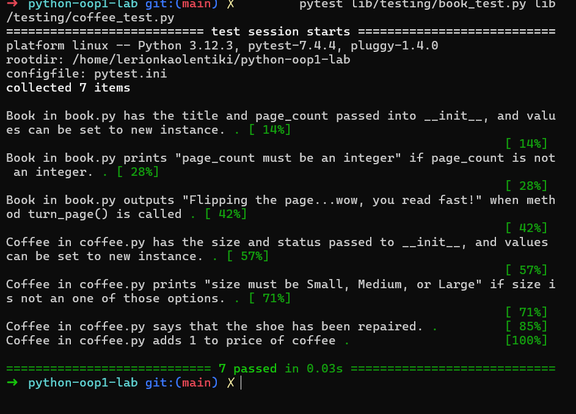

# Bookstore OOP Lab

A small Python object-oriented programming exercise modeling two objects sold
in a bookstore: a `Book` and a `Coffee`. Built as part of the Moringa School
Python curriculum.

## Description

This project defines two classes:

- **`Book`** (`lib/book.py`) — represents a book with a `title` and a
  `page_count`. The `page_count` is validated to ensure it's an integer; if
  not, it prints `"page_count must be an integer"` and rejects the value.
  Calling `turn_page()` prints `"Flipping the page...wow, you read fast!"`.

- **`Coffee`** (`lib/coffee.py`) — represents a coffee with a `size` and a
  `price`. The `size` is validated against `"Small"`, `"Medium"`, or
  `"Large"`; if invalid, it prints `"size must be Small, Medium, or Large"`
  and rejects the value. Calling `tip()` prints
  `"This coffee is great, here's a tip!"` and increases the price by 1.

Both classes were built test-first against the suite in `lib/testing/`.

## Installation

Clone the repo and install dependencies:

```console
$ git clone git@github.com:Frost-Asnyc/python-oop1-lab.git
$ cd python-oop1-lab
$ pipenv install
$ pipenv shell
```

## Usage

Run the test suite with `pytest`:

```console
$ pytest lib/testing/book_test.py
$ pytest lib/testing/coffee_test.py
```

Example test run:



Or use the classes directly:

```python
from lib.book import Book
from lib.coffee import Coffee

book = Book("And Then There Were None", 272)
book.turn_page()  # Flipping the page...wow, you read fast!

coffee = Coffee("Large", 3.50)
coffee.tip()  # This coffee is great, here's a tip!
```

## Support

Questions or issues can be raised on this repo's Issues tab.

## Project status

Complete — both classes implemented and all tests passing.

 